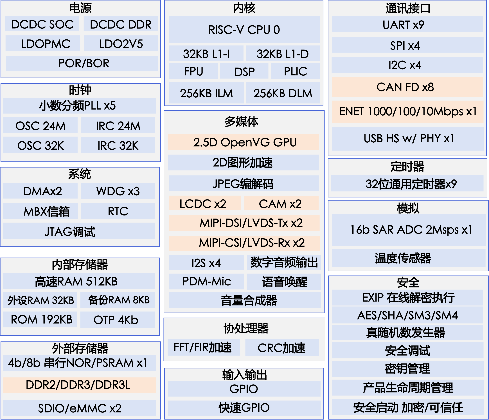

# 扒光HPM6800系列 | 强到起飞的显控MCU介绍

HPM6800 系列 MCU 是上海先楫半导体科技有限公司推出的一款高性能、专注图像显示的 RISC-V 内核微控制器。HPM6800 系列提供高性能 2.5D OpenVG GPU，支持 MIPI-DSI 或 LVDS接口双屏显示，以及 MIPI-CSI 或LVDS 双摄像头接口，同时提供高速 DDR2/DDR3/DDR3L 外扩大容量高速存储。

## cpu特性

- RISC-V CPU 支持双精度浮点运算及强大的 DSP 扩展，主频超过 600 MHz，性能超过 3390 CoreMarkT M和 1710 DMIPS。
- 32KB 高速缓存 (I/D Cache) 和高达 512KB 的零等待指令和数据本地存储器 (ILM / DLM)，加上 512KB 通用SRAM，极大避免了低速外部存储器引发的性能损失。

## 图像系统

- 1 个 2.5D OpenVG 1.1 GPU，支持VGLite图形库。
- 1 个 2D 图形加速器(PDMA)，支持平移、旋转，镜像，缩放和颜色空间转换等功能。
- 1 个 RGB 显示接口。
- 1 个 DVP 摄像头接口。
- 2 个 4 Lane MIPI-DSI/LVDS-Tx 显示接口，可支持双路LVDS显示，分辨率高达1080P。
- 2 个 2 Lane MIPI-CSI/LVDS-Rx 摄像头接口。
- 2 个 LCD 控制器支持多图层 Alpha-blending。1080P/60FPS分辨率，可支持双屏异显。
- 集成 JPEG 编解码器可实现快速 JPEG 编码和解码，减轻处理器负荷。

## 存储器接口

- DDR 控制器，支持 DDR2-800、DDR3-1333，DDR3L-1333。
- 1 个串行总线控制器，支持 NOR Flash / HyperFlash，支持 NOR Flash 在线加密执行，提供扩展性和兼容性极高的程序空间。
- 2 个 SD/eMMC 控制器。

## 丰富外设

- 多种通讯接口：1 个内置 PHY 的高速 USB，1 个千兆以太网口，多达 8 路 CAN/CAN-FD 及丰富的 UART、SPI、I2C 等外设。
- 1 个 2MSPS 16 位高精度 ADC，配置为 12 位精度时转换率可达 4MSPS。
- 多达 36 路 32 位定时器，3 个看门狗和 RTC。
- 4 个 8 通道全双工 I2S 和 1 个数字音频输出。
- 多路语音和数字麦克风接口。

## 安全

- 集成 AES-128/256, SHA-1/256 加速引擎和硬件密钥管理器。支持固件软件签名认证、加密启动和加密执行，可防止非法的代码替换、篡改或复制。
- 基于芯片生命周期的安全管理，以及多种攻击的检测，进一步保护敏感信息。
- 内建 Boot ROM，可以通过 USB 或者 UART 对固件安全下载和升级。

## 资料下载

先楫的官网可以直接下载到各类芯片资料、开发板资料以及软件SDK的资料。先楫主打的是RISC-V的MCU，也继承了RISC-V开放性，所以资料开放程度非常的高，对于开发者来讲是比较方便的。**这里吐槽一下其他很多国内厂家，总把资料捂得严严实实的，开放程度非常的低**

- 先楫官网: https://www.hpmicro.com/  
- 网盘资料: 链接：https://pan.baidu.com/s/1XGChrZrARTMxA2kannQTgg?pwd=hp11  提取码：hp11  
- SDK仓库: https://gitee.com/hpmicro/hpm_sdk  
- 视频资料: https://space.bilibili.com/1306310554 或者b站搜索`先楫半导体HPMicro`  

*注意：我对比了一下官网和网盘的资料，看上去网盘的资料比官网的更新要滞后*

## 后续文章的更新安排

先楫的HPM6800系列的MCU主打的是显示和控制，具有非常丰富的显示接口包括MIPI DSI/CSI，LVDS, RGB，DVP，不仅如此，这个MCU竟然还挂了一个**DDR控制器**和一个**矢量GPU**，注意是真的GPU不是很多MCU上面的2D图形加速器，看上去应该是Versilicon的IP核，所以HPM6800是一款可玩性非常高的王炸级的MCU。很多MPU的外设都下放到了MCU上，国内基本上是找不到第二个，这也是博主想玩一玩这一款MCU的主要原因。

对于后面的安排，看到网上也有很多人去介绍先楫的芯片，包括各种入门教程，常用外设的使用，但是博主并没有发现有人去深入的挖掘先楫的显示方面的功能。所以不打算重复造轮子，准备借着先楫的这款芯片学习一下显示相关的功能和RISC-V架构相关的知识，并把学习和开发过程中遇到的问题，整理成文章记录下，方便同行们互相交流。

