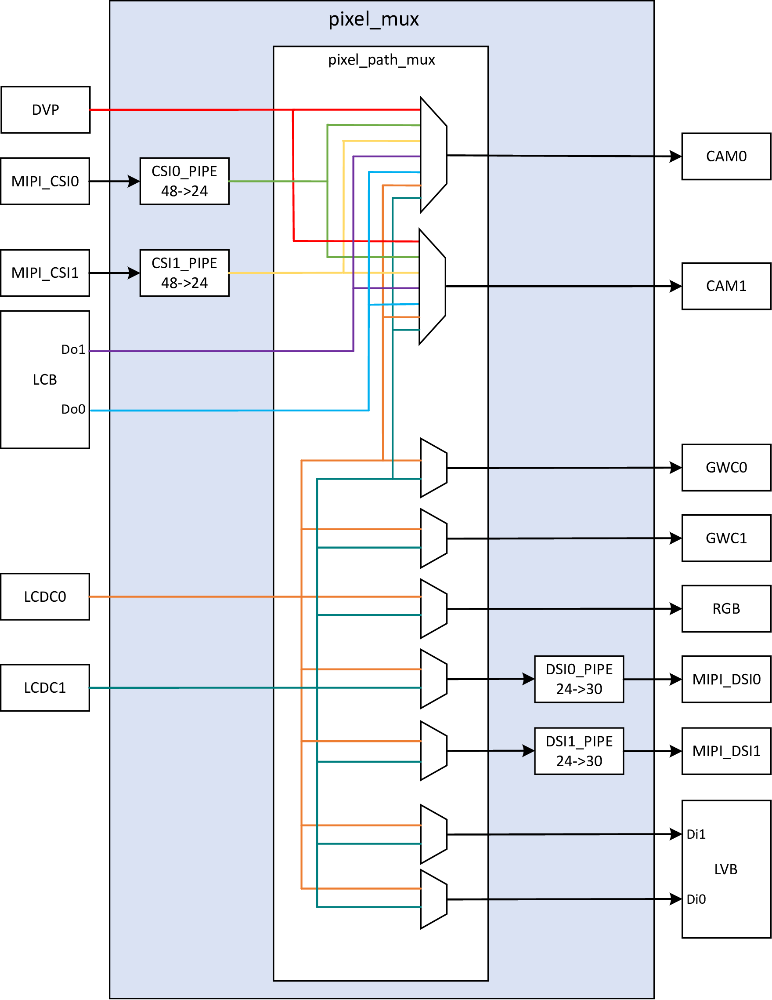
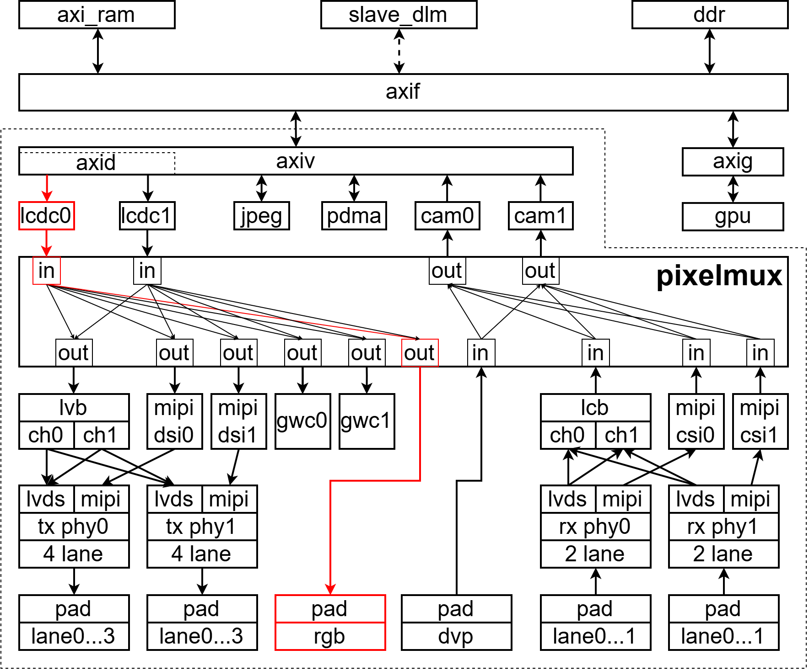
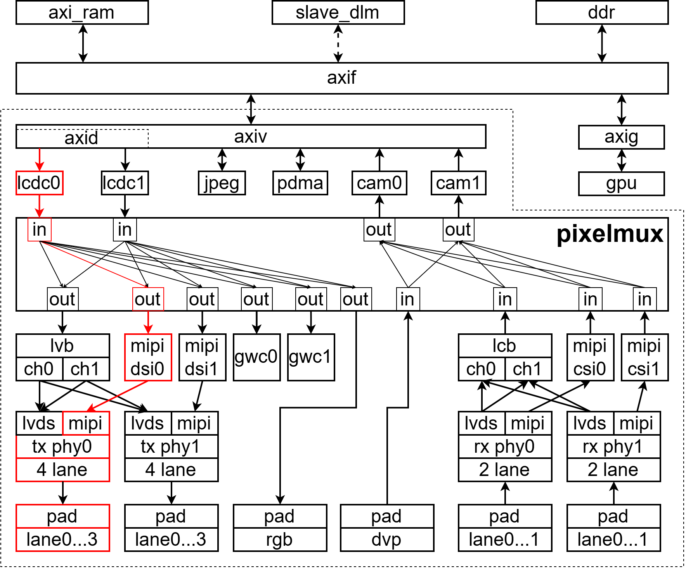
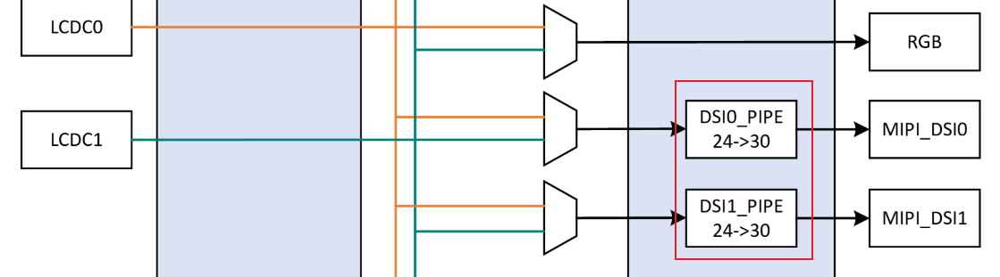
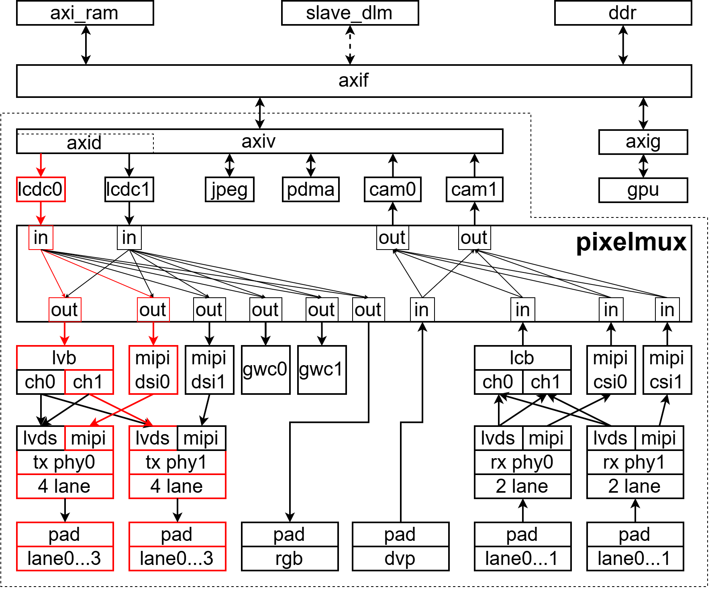
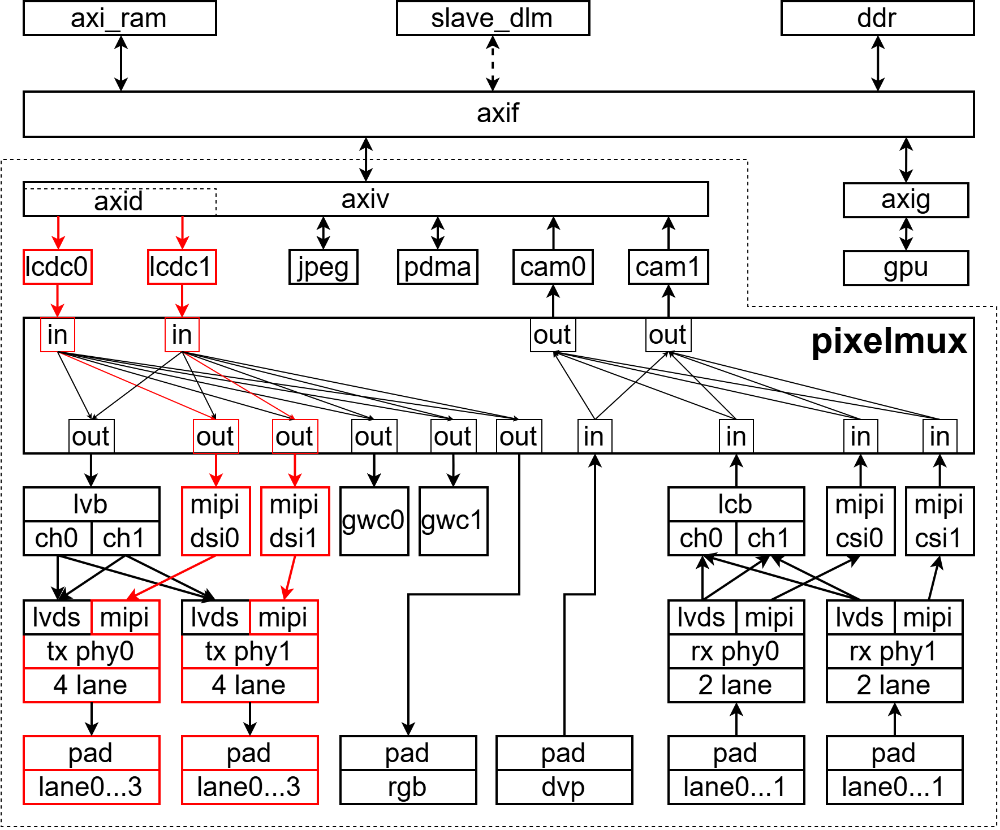

# 扒光HPM6800系列 | 显示子系统架构介绍

HPM6800的显示子系统具有丰富图形外设，上图全面清晰的展示了整个显示子系统的功能结构，通过这个图我们可以容易的了解每个外设接口的像素的数据流向以及每个外设之间的互联关系。
显示子系统主要由内存访问总线、PIXELMUX、显示类IP、摄像头类IP以及图像处理类IP组成。

## 内存访问总线

内存访问总线用于显示子系统内的图形IP访问内存。每个图形IP都有各自的axi内存访问接口，通过axi接口就可以访问内存设备。比如进行像素数据的读写。

- **axif总线矩阵**

axif是axi fast的缩写，通过axif总线几乎可以访问到soc上所有类型的内存设备，比如axi_ram，ddr和slave_dlm。对于HPM6800最常用的就是ddr类型的内存，因为容量大并且速度快。图形类的IP对内存都有很高的访存需求，所以ddr类型的内存几乎可以满足所有的使用场景。

- **axiv总线矩阵**

axiv是axi vision的缩写，这个总线主要挂接的是各类图形IP，其中包括lcdc，cam，jpeg以及pdma。axiv可以通过axif访问到内存设备，而这些图形IP通过axiv进行内存设备的访问。
通过上图可以看到cam、jpeg和pdma是通过axiv的时钟域去访问内存的，而lcdc是通过axid时钟域去访问内存的。我们简单的理解lcdc的axi总线的时钟速度是axid。而cam、jpeg和pdma的axi总线时钟速度是axiv。
axid只是axiv总线矩阵的一个端口，是一个异步时钟域，也就是和axiv总线桥时钟不一样。而cam、jpeg和pdma的所在的端口和axiv总线桥时钟域相同。一般情况下图形IP的core时钟来和axi时钟是同频的。换句话说lcdc这个IP的时钟是axid，而其他三个IP的时钟是axiv。时钟对IP非常重要，我们后面单独介绍每个IP的时候会重点介绍。

- **axig总线桥**

axig是axi gpu的缩写，这个总线桥主要用于gpu和axif之间的连接，gpu可以通过axig和axif访问各种类型的内存设备。

## pixelmux

PIXELMUX负责VIS子系统中各个图像模块之间的图像数据互联等功能，并且也提供了一些IP的杂项配置功能，比如lvds的phy的配置，以及IP之间互联时候像素的转换配置等。
通过上图，我们可以清楚的看到像素数据流的走向，比如，我想通过lcdc0和rgb接口显示，那么首先需要通过pixelmux把像素的链路打通。如下图所示

- **in/out 端口**

在pixelmux上无论是in端口还是out端口，都会有一个图形IP与之对应，也就是图形IP会通过in或者out端口挂接到pixelmux上的,每个像素会通过in端口流入，经过pixelmux，从**一个或多个**out端口流出。这个过程可能会改变像素的格式，也可能保持不变。具体是否改变像素的格式取决于in端口对应的IP和out端口对应的IP像素是否一致。

- **像素格式转换**

上面我们提到像素从in端口流向out端口的时候数据，像素格式可能会改变。

比如，上图我们通过`lcdc0->mipi_dsi0`这种通路去显示，那么lcdc0输出的像素会到pixelmux的in端口，经过pixelmux后，从pixelmux的out端口进入到mipi_dsi0。这时候就会需要开启像素格式转换。因为lcdc输出的像素格式，可能并不是mipi_dsi需要的像素格式。这个时候就需要把lcdc输出的像素转换成mipi_dsi需要的像素格式。关于mipi_dsi需要的像素格式我们会在mipi_dsi的相关文章中重点讲述。这里仅是想说明pixelmux具有像素格式转换的功能。不仅仅是一个像素的互联开关。

## 双屏同/异显

先楫的显示子系统通过pixelmux这个外设，将像素可以灵活的进行流转，这也为双屏同显和双屏异显提供了可能性。上文我们也有提到pixelmux的in端口可以对应一个或者多个out端口，也就是in端口进来的像素，可以分发到多个out端口，这样就可以实现双屏同显。

- **双屏同显**

双屏同显顾名思义，就是两个显示器的图像是完全一样的。理论上我们可以实现比如2个mipi屏同显，也可以是2个单路lvds屏同显，或者1个lvds和一个mipi屏同显，但是做不到mipi和rgb同显或者lvds和rgb同显，并不是这套显示子系统不支持，而是HPM6800这个MCU的引脚不支持，因为RGB和MIPI和LVDS的引脚是有复用的。此外，一定要注意，双屏同显这需要两个屏的分辨率必须是相同的，因为两个屏接收的是同一个lcdc输出的像素。
下面通过pixelmux的示意图，展示一下1个lvds和1个mipi进行双屏同显。

- **双屏异显**

HPM6800具备两个lcdc控制器，这为双屏异显提供了可能。因为有两个lcdc控制器，那我们可以驱动两个完全独立的显示屏。比如2个mipi屏异显，也可以是2个单lvds屏异显，或者1个lvds和一个mipi屏异显，但是同样做不到mipi和rgb异显或者lvds和rgb异显。下面通过pixelmux的示意图，展示一下2个mipi进行双屏异显。

## 后续安排

我们会以此文章为基础，后续会分别讲解每一个外设的功能及编程模型和使用方法。对于掌握先楫的显示子系统，这个文首的框图尤其重要，这是博主吐血整理的，它展示了先楫显示子系统的全局视角以及每个外设之间的互联关系。后面博主的连载文章中也会多次使用此图，对先楫的显示子系统感兴趣的小伙伴，一定要深入理解此图，当然有不对的地方也请官方或者开发者们及时指出。
